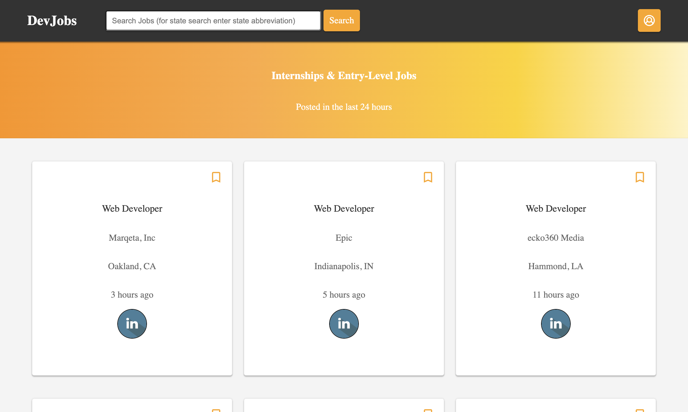

# PyJobSearch

A job posting website that pulls data from several other websites. All jobs were posted that day, and all jobs are entry level or intern positions. 

This website was created using Python, Flask, BeautifulSoup, Javascript, CSS, and HTML. It was deployed to Heroku.

Website URL: [Heroku](http://github.com)
